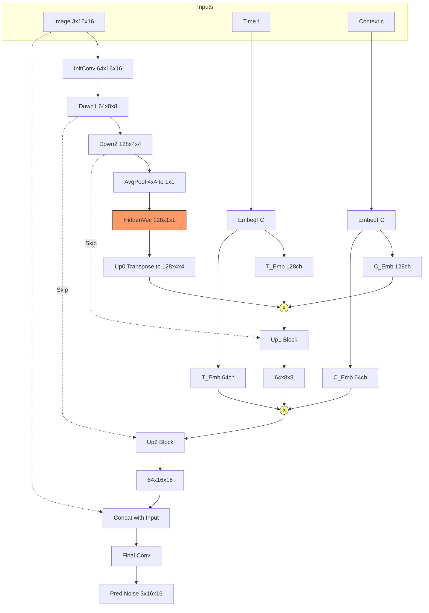

# ContextUnet Architecture Analysis

This document breaks down the `ContextUnet` class found in `algorithm_sampling.py`. This network is the core "brain" of the diffusion model, responsible for predicting noise at each timestep, conditioned on both the time step $t$ and the context (label) $c$.

## 1. Input & Initial Convolution
*   **Input Image ($x$):** Shape `(Batch, 3, 16, 16)`.
*   **Initial Block (`init_conv`):**
    *   A `ResidualConvBlock` with `is_res=True`.
    *   Expands channels from **3 (RGB)** to **64 (n_feat)**.
    *   Maintains spatial dimensions: **16x16**.
    *   Output: `(Batch, 64, 16, 16)`.

## 2. Downsampling Path
The model compresses the image to extract high-level features.

*   **Down 1 (`down1`):**
    *   Input: `(Batch, 64, 16, 16)`.
    *   Operation: `ResidualConvBlock` (features) + `MaxPool2d(2)` (halves size).
    *   Output Channels: 64.
    *   Output Shape: `(Batch, 64, 8, 8)`.

*   **Down 2 (`down2`):**
    *   Input: `(Batch, 64, 8, 8)`.
    *   Operation: `ResidualConvBlock` + `MaxPool2d(2)`.
    *   **Crucial Change:** Expands channels to `2 * n_feat` (**128**).
    *   Output Shape: `(Batch, 128, 4, 4)`.

## 3. The Bottleneck (`to_vec`)
This step turns the spatial feature map into a dense feature vector.

```python
self.to_vec = nn.Sequential(nn.AvgPool2d((4)), nn.GELU())
```

*   **Input:** `(Batch, 128, 4, 4)`.
*   **`nn.AvgPool2d(4)`:** The kernel size is 4. Since the input is 4x4, this operation averages **all** pixels in each channel into a single value.
    *   It does **not** make it 2x2. It collapses the spatial dimensions completely to **1x1**.
*   **`nn.GELU()`:** Activation function.
*   **Output (`hiddenvec`):** `(Batch, 128, 1, 1)`.
    *   This is now a "latent vector" representing the compressed essence of the noisy image.

## 4. Embeddings (Time & Context)
The model needs to know "what time is it?" (noise level) and "what class is this?" (context).

```python
cemb1 = self.contextembed1(c).view(-1, self.n_feat * 2, 1, 1)
temb1 = self.timeembed1(t).view(-1, self.n_feat * 2, 1, 1)
```

1.  **EmbedFC:** A small Multi-Layer Perceptron (Linear -> GELU -> Linear) that projects the scalar time $t$ or context vector $c$ into a high-dimensional embedding.
2.  **`.view(..., 1, 1)`:** Reshapes the vector (e.g., length 128) into a 4D tensor `(Batch, 128, 1, 1)`.
    *   **Why?** This allows the embedding to be added/multiplied with image feature maps (which are 4D tensors) using broadcasting.
3.  **Two Sets:**
    *   **Set 1 (`cemb1`, `temb1`):** Project to **128 channels** (`2 * n_feat`). Used for the deeper layer (`up1`).
    *   **Set 2 (`cemb2`, `temb2`):** Project to **64 channels** (`1 * n_feat`). Used for the shallower layer (`up2`).

## 5. Upsampling Path
The model reconstructs the noise/image from the bottleneck, injecting information from the skip connections (`down1`, `down2`) and the embeddings.

*   **Up 0 (`up0`):**
    *   Input: `hiddenvec` (128, 1, 1).
    *   Operation: `ConvTranspose2d` with kernel/stride size `h//4` (16//4 = 4).
    *   Action: Mathematically the reverse of the AvgPool. It expands 1x1 back to **4x4**.
    *   Output: `(Batch, 128, 4, 4)`.

*   **Up 1 (`up1`):**
    *   **Conditioning:** `cemb1 * up1 + temb1`. The embeddings modulate the features from `up0`.
    *   **Skip Connection:** Concatenates with `down2` (the 4x4 feature map from the down path).
    *   Operation: `UnetUp` (Upsamples 4x4 -> 8x8).
    *   Output: `(Batch, 64, 8, 8)`.

*   **Up 2 (`up2`):**
    *   **Conditioning:** `cemb2 * up2 + temb2`.
    *   **Skip Connection:** Concatenates with `down1` (the 8x8 feature map).
    *   Operation: `UnetUp` (Upsamples 8x8 -> 16x16).
    *   Output: `(Batch, 64, 16, 16)`.

## 6. Final Output (`out`)
*   **Input:** Concatenation of `up3` (from Up 2) and the original input `x`.
*   **Operation:** Standard convolutions to reduce channels back to 3.
*   **Output:** `(Batch, 3, 16, 16)` (The predicted noise).

## Visual Architecture Diagram



## Additional Notes

### GroupNorm vs BatchNorm
The architecture uses `GroupNorm` in the up-sampling and output blocks, while `ResidualConvBlock` uses `BatchNorm`.

- **Batch Normalization (`BatchNorm2d`)**:
  - Normalizes across the **Batch** dimension.
  - Relies on batch statistics.
  - Can be unstable with small batch sizes (common in diffusion training).
  - Used in the residual blocks here.

- **Group Normalization (`GroupNorm`)**:
  - Normalizes across the **Channel** dimension (splitting channels into groups).
  - **Independent of batch size**. Works consistently even with a batch size of 1.
  - Ensures that the generation of one image does not depend on other images in the batch, which is crucial for consistent inference/sampling in generative models.
