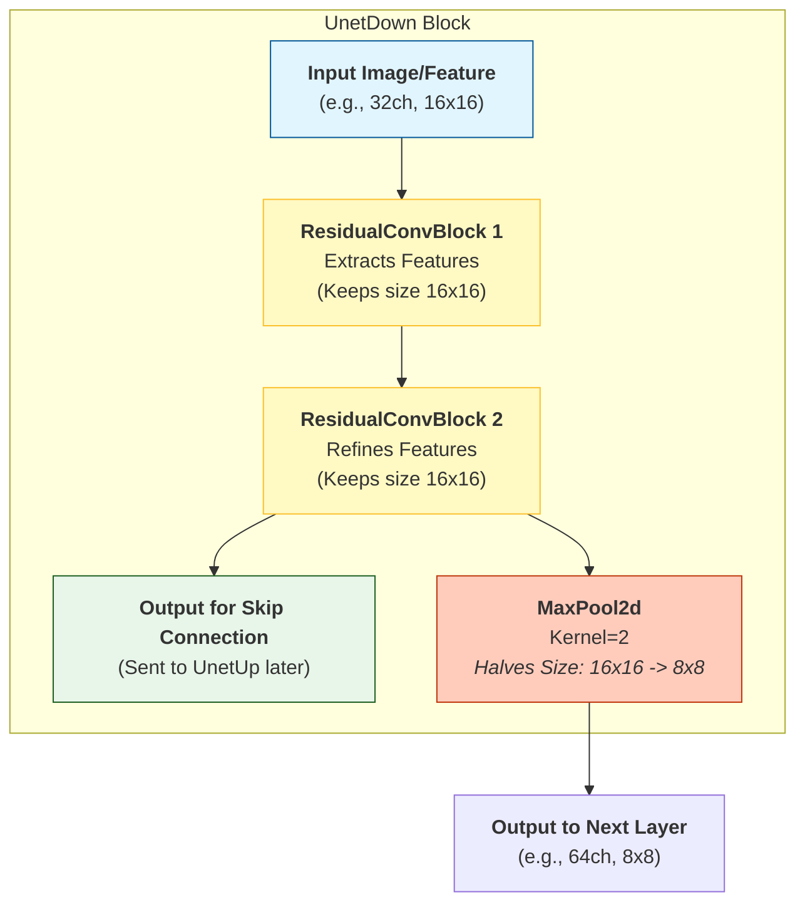

# UnetDown Architecture

This block is the "Encoder" part of the network. Its job is to **process features** at the current resolution and then **shrink** the image to find higher-level abstract patterns.

## The Flow



## The Logic

1.  **Process (x2):** It runs two `ResidualConvBlock`s. This allows the network to "think" about the image at this specific resolution (16x16) and extract useful details (edges, textures).
2.  **Save for Later:** The output of these blocks is what gets sent across the "Skip Connection" to the `UnetUp` block later.
3.  **Shrink:** Finally, `nn.MaxPool2d(2)` looks at every 2x2 square of pixels and keeps only the biggest value. This cuts the width and height in half ($16 \rightarrow 8$), forcing the network to summarize the information.

## The Math: MaxPool2d (Downsampling)

The formula for calculating the output size is:
$$ H_{out} = \left\lfloor \frac{H_{in} + 2 \times \text{padding} - \text{kernel\_size}}{\text{stride}} + 1 \right\rfloor $$

In `UnetDown`, the layer is `nn.MaxPool2d(2)`, which implies:
*   **Kernel Size ($k$):** 2
*   **Stride ($s$):** 2 (defaults to kernel size)
*   **Padding ($p$):** 0

**Example (16x16 input):**
$$ H_{out} = \left\lfloor \frac{16 + 0 - 2}{2} + 1 \right\rfloor = 8 $$

**What if there is a remainder?**
PyTorch's default behavior (`ceil_mode=False`) is to **drop** the last pixels if they don't fit into the kernel window. The $\lfloor \dots \rfloor$ (floor) operation handles this.

*   **Input 15:** $\lfloor \frac{15-2}{2} + 1 \rfloor = \lfloor 7.5 \rfloor = 7$ (The 15th pixel is ignored).

```