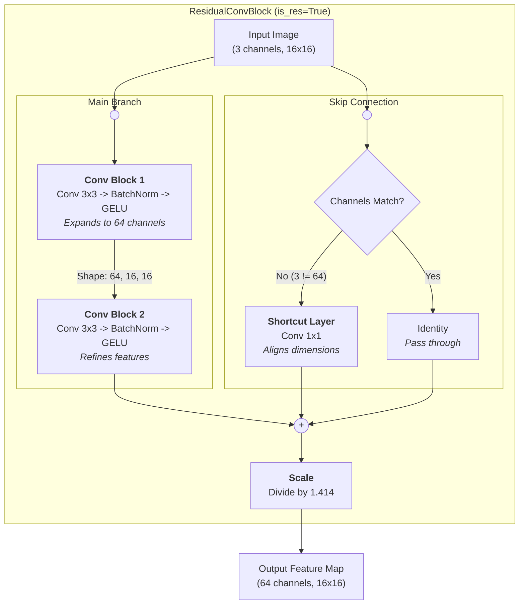

# ResidualConvBlock Architecture

```mermaid
graph TD
    Input["Input Image<br/>(3 channels, 16x16)"]

    subgraph "ResidualConvBlock (is_res=True)"
        direction TB
        
        %% Forking paths
        Input --> MainPath_Start
        Input --> SkipPath_Start

        %% --- Main Processing Branch (The "Work") ---
        subgraph Main_Branch [Main Branch]
            direction TB
            MainPath_Start(( )) --> Conv1["<b>Conv Block 1</b><br/>Conv 3x3 -> BatchNorm -> GELU<br/><i>Expands to 64 channels</i>"]
            Conv1 -->|"Shape: 64, 16, 16"| Conv2["<b>Conv Block 2</b><br/>Conv 3x3 -> BatchNorm -> GELU<br/><i>Refines features</i>"]
        end

        %% --- Skip Connection Branch (The "Memory") ---
        subgraph Skip_Connection [Skip Connection]
            direction TB
            SkipPath_Start(( )) --> Check{"Channels Match?"}
            Check -- "No (3 != 64)" --> Conv1x1["<b>Shortcut Layer</b><br/>Conv 1x1<br/><i>Aligns dimensions</i>"]
            Check -- "Yes" --> Identity["Identity<br/><i>Pass through</i>"]
        end

        %% --- Recombination ---
        Conv2 --> Add((+))
        Conv1x1 --> Add
        Identity --> Add
        
        Add --> Scale["<b>Scale</b><br/>Divide by 1.414"]
    end

    Scale --> Output["Output Feature Map<br/>(64 channels, 16x16)"]
```