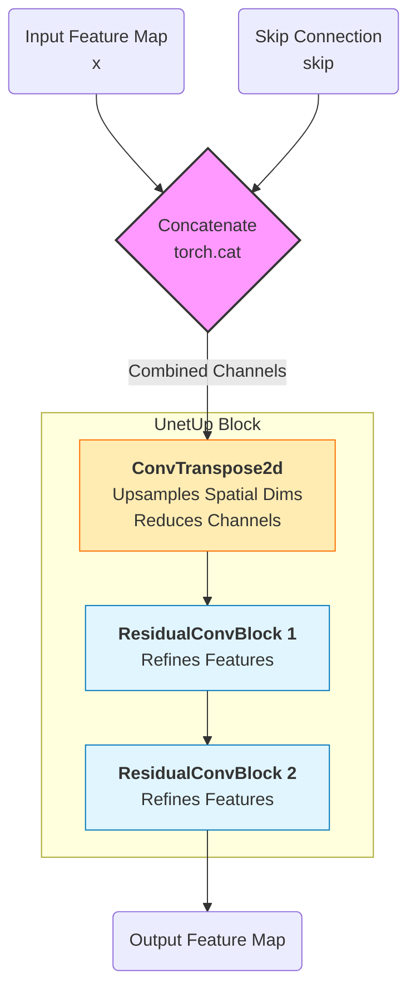

# UnetUp Class Architecture

This class handles the upsampling path of the U-Net. In this specific implementation, it concatenates the skip connection features *before* performing the upsampling operation.

## Data Flow Diagram

## Detailed Layer Logic

1.  **Concatenation (`torch.cat`)**:
    *   **Input:** `x` (Main path) and `skip` (Skip connection).
    *   **Action:** Stacks them along the channel dimension.
    *   **Shape Change:** $(B, C, H, W) + (B, C, H, W) \to (B, 2C, H, W)$.

2.  **Transposed Convolution (`nn.ConvTranspose2d`)**:
    *   **Action:** Upsamples the image while reducing channels.
    *   **Parameters:** `kernel_size=2`, `stride=2`.
    *   **Mechanism:** Inserts zeros between pixels (dilation) and convolves, effectively doubling height and width.
    *   **Formula:** 
        $$ H_{out} = (H_{in} - 1) \times \text{stride} - 2 \times \text{padding} + \text{kernel\_size} $$
        *Substituting values (stride=2, pad=0, k=2):*
        $$ H_{out} = (H_{in} - 1) \times 2 + 2 = 2H_{in} $$

3.  **Residual Blocks**:
    *   Standard convolution blocks to process the features after upsampling.
    *   Dimensions ($H, W$) remain constant; channels remain constant.

## How Transpose Convolution Works
*Also known as Deconvolution*

This operation is mathematically equivalent to inserting zeros between your input pixels and then performing a normal convolution. For the specific parameters used here (`kernel_size=2`, `stride=2`), it functions as a "Stamping" operation.

### 1. The "Zero Insertion" Step
The operation effectively pulls the input pixels apart and fills the gaps with zeros (dilation), then convolves over them.

### 2. The "Stamping" View
Because **Kernel Size = Stride** (both are 2), every single pixel in the input is "projected" or "stamped" into a distinct $2 \times 2$ area in the output.

**Visualizing 2x2 Input $\to$ 4x4 Output:**

```mermaid
graph TD
    subgraph Input ["Input (2x2)"]
        direction TB
        R1[Row 1: A  B]
        R2[Row 2: C  D]
    end

    subgraph Process ["Process (Expand & Convolve)"]
        A --> |Multiplies Kernel| KA[2x2 Block from A]
        B --> |Multiplies Kernel| KB[2x2 Block from B]
        C --> |Multiplies Kernel| KC[2x2 Block from C]
        D --> |Multiplies Kernel| KD[2x2 Block from D]
    end

    subgraph Output ["Output (4x4)"]
        O1["Block A  &#124;  Block B"]
        O2["-------  &#124;  -------"]
        O3["Block C  &#124;  Block D"]
    end
    
    KA --> O1
    KB --> O1
    KC --> O3
    KD --> O3
```

### Summary of Dimensions
*   **Input:** $H \times W$
*   **Action:** Each pixel becomes a $2 \times 2$ block.
*   **Output:** $2H \times 2W$ (Dimensions are doubled).